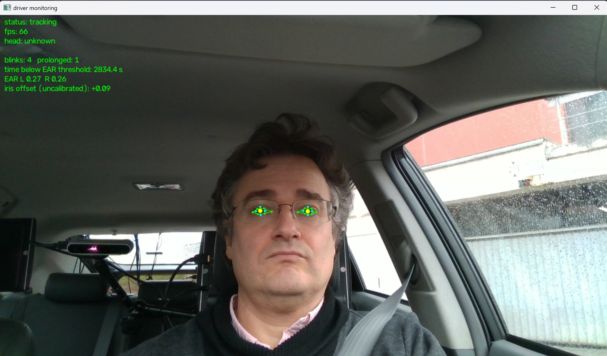
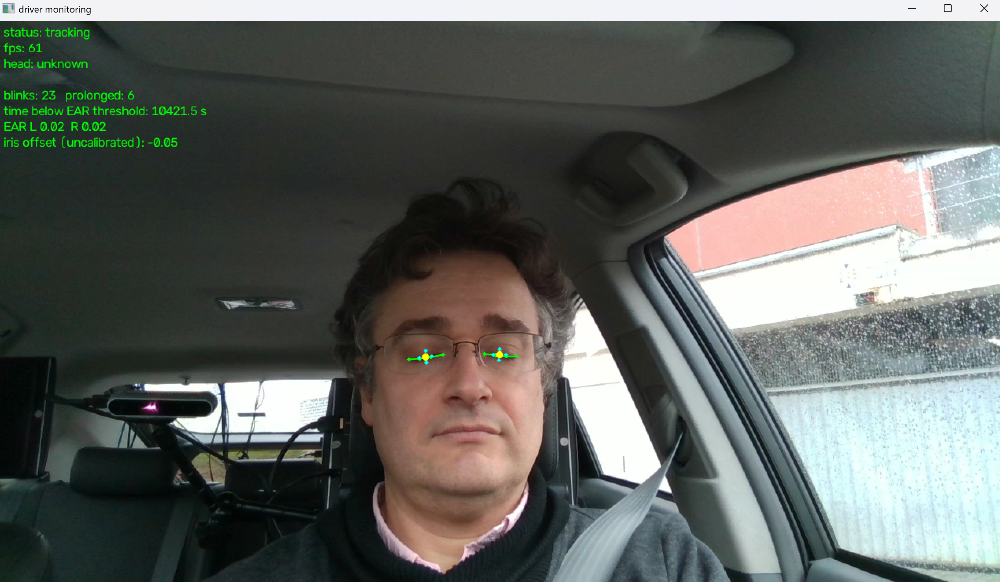

# driver monitoring demo

A small demo: approximate **head orientation**, **blink /
eye-closure** tracking and **eye/iris landmark overlay** from a laptop webcam
(or a video file). Built with Python, OpenCV and MediaPipe Face Landmarker.

It does **not** estimate precise gaze, drowsiness or driver attention — those
are explicitly out of scope.

## Screenshots





## Setup

```powershell
py -m venv .venv
.venv\Scripts\pip install -r requirements.txt
```

The Face Landmarker model is already at `models/face_landmarker.task`
(3.76 MB, sha256 `64184e229b263107bc2b804c6625db1341ff2bb731874b0bcc2fe6544e0bc9ff`).
Re-download it from Google's Face Landmarker guide if needed.

## Run

```powershell
.venv\Scripts\python main.py                    # webcam
.venv\Scripts\python main.py --video clip.mp4   # replay a video file (e.g. DMD)
.venv\Scripts\python main.py --auto-calibrate   # neutral = first valid frame
```

Controls: **q** quit · **c** calibrate neutral head pose · **r** reset counters.

Flags: `--close` / `--reopen` (EAR thresholds, defaults 0.20 / 0.24),
`--mirror` (default: on for webcam, off for video).

## How it works

- **Blink** — per-eye EAR in *pixel* coordinates (6 eyelid landmarks), with
  hysteresis (distinct close / reopen thresholds). A bilateral event counts
  once on reopening if both eyes were closed 60–500 ms; longer closures are a
  separate "prolonged" count. Frame gaps > 100 ms or tracking loss reset any
  pending event. Timestamps are monotonic, never frame counts.
- **Head orientation** — OpenCV `solvePnP` (EPnP) on 6 face landmarks against a
  generic symmetric 3D model, reported *relative to a captured neutral pose*
  (`c` key). Yaw/pitch use enter ±15° / exit ±10° hysteresis with 300 ms
  persistence. Approximate: assumed focal length ≈ 0.8× image width, centred
  principal point, zero distortion; implausible fits (face behind camera or
  reprojection error > 10% of width) are rejected as unknown.
- **Iris** — the 10 iris landmarks (5 per eye) overlaid; a normalized iris
  offset is shown but uncalibrated (not a gaze estimate).
- **Unknown** — no face, unusable eyes or an implausible pose all show an
  explicit unknown status rather than a guessed value.

## Tests

```powershell
.venv\Scripts\python test_tracking.py   # 6 self-checks, no camera/model needed
```

## Demo footage (DMD)

DMD (Driver Monitoring Dataset, Vicomtech) is gated behind a "request access"
form (email + name + organisation + accept terms), CC BY-NC-ND 4.0, academic
use only. Three subsets:

- Drowsiness — `https://opendatasets.vicomtech.org/di21-dmd-dataset-drowsiness/99e2fbd7`
- Gaze & Hands — `https://opendatasets.vicomtech.org/di21-dmd-dataset-gaze/8433939e`
- Distraction — `https://opendatasets.vicomtech.org/di21-dmd-dataset-distraction-rgb-ir/a268f10c`

Replay downloaded clips with `--video`. Note: a foreign clip has no neutral-pose
calibration — use `--auto-calibrate` (first frame as neutral) or press `c`, and
treat the labels as approximate.

## Validation (DMD gA/1/s5)

`validate.py` scores blink detection against a DMD OpenLABEL annotation:

```powershell
.venv\Scripts\python validate.py --video <rgb_face.mp4> --annotation <ann_drowsiness.json>
```

Results on `gA/1/s5` (male, glasses, 1280×720, 29.76 fps, ~3 min,
83 annotated blinks):

- Face and both eyes detected on **100%** of frames — glasses are no obstacle.
- Blink **precision 0.94–1.00** across thresholds: the bilateral + hysteresis
  logic does not fabricate blinks.
- Blink **recall ~0.55** (best F1 0.72 at `--close 0.18`). The ceiling is real:
  only 28 of 83 annotated blinks ever reach a fully-closed state — the rest are
  partial closures a plain EAR threshold cannot catch (matches research S1).
- EAR separates cleanly: open median **0.25**, closed median **0.018**.

Default `--reopen 0.24` is too loose for this subject (open-eye EAR median is
0.25), pushing short blinks into "prolonged"; for DMD footage use
`--close 0.18 --reopen 0.20`.

## Limitations

- Relative, not absolute, head angles; the generic face model and assumed
  intrinsics do not support degree-accuracy claims.
- EAR thresholds are defaults, not calibrated to a specific person/camera;
  tune with `--close` / `--reopen` against your own clips.
- Iris offset is not gaze. No drowsiness/fatigue inference is made.
- RGB only: poor light, glasses glare, occlusion and large head rotation will
  degrade or produce "unknown".

## Structure

- `main.py` — capture/display loop and overlay.
- `tracking.py` — EAR, blink state machine, head pose, hysteresis (no I/O).
- `validate.py` — blink/head-pose scoring against a DMD OpenLABEL annotation.
- `test_tracking.py` — runnable self-checks.
- `requirements.txt` — pinned dependency versions.
